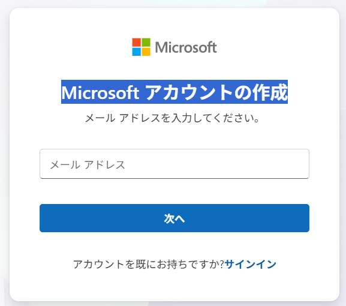
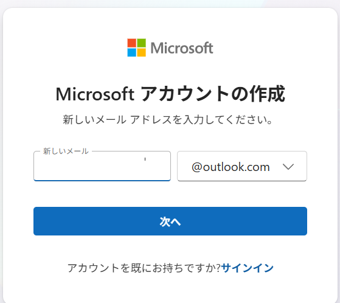
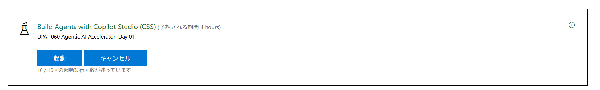

# Microsoft Learn 

## Lab の心構え

### ガイドと実際のAzureの画面が異なっていて迷う場合があります。
・よく確認すると大体できることばかりです。今後も、MSの製品はアップデートが繰り返されます。Labチームと、AzureやMS製品との同期は困難といわれています。これはどこの製品も同じです。学習用のガイド通りにやっていく中で、公式の資料やラボのガイドと実際の画面に差分が出ます。

・実際の画面を確認しながら、多少異なる表記があっても、推察しながら進めて解決できるスキルを身に着けることも目標にしてください。

・どうしても迷う場合にこちらの資料を確認したり、質問するようにしてください。（まずはご自身でトライしていく姿勢とスキルもこの講座でぜひ身に着けてください）

----
## Lab の利用方法
### 0. Private WindowでEdge または Chrome などのブラウザを開いてください
※通常使っているブラウザだと、ご自身のMSアカウントでログインしてしまう可能性があり、上手くいかないなどが発生します。

### 1. 以下のページにアクセスしてください。
https://esi.learnondemand.net/

### 2. Sign Inをクリック > Microsoft Account をクリック

### 3. サインイン画面で、個人用のMSアカウントを作成します。
画面下部にある、「Microsoft のご利用は初めてですか?アカウントを作成する」をクリック。

### 4. Microsoft アカウントの作成の画面で、任意の名前で「outlook.com」ドメインでメールアドレスを作成してください。
※既に個人用で使えるアドレスがあればそちらを利用してもOKです。

### 5. ESIの画面が表示されるので、Countryに「Japan」を選択し、「はい」をクリック

### 6. ESIの画面で「トレーニングキーを利用する」をクリックし、Teamsのチャットで連絡されたトレーニングキーを入れて「トレーニングキーを利用する」をクリック

### 7. 利用できるHands on Labsが表示されるので、「起動」をクリックすると、ラボ環境が仮想環境として起動でき、この後はこの中でラボを行っていくことになります

----

## 注意
### ログインの際には、LAB に登録した、MSアカウントではなく、LAB 内の Instructionsの冒頭 及び Resourcesタブ内に記載のあるアカウント（Azure Credentialsなど）を利用してください。

### 仮想マシンの中のIMEモードと、ご自身の端末のIMEモードが衝突しやすい環境です。かならずご自身の端末のIMEモードは、「A」（アルファベット入力）にしてください（※日本語入力モードにしないでください）

### Instructionsや、Resourcesにある内容は、クリックすると仮想マシン側に代理で入力してくれるので、直接入力せずにクリックしてみてください。

###  ※Azureの画面のアップデートが早くラボ環境のガイドと実態が合わなくなることは往々にしてあります。今後のためにもそういった点の耐久性をつけておいていただくことも目的にしています

###  ※アイコンがあるところでクリックすれば、仮想マシン側に入ります。

###  ※あくまでキーボードを介しますので、入力完了までは他の場所をクリックしたりしないようにしてください。

### ※英語での記載のため、ブラウザの翻訳機能が使えます。但し翻訳した状態で、上記の入力補完のアイコンなどをクリックすると、翻訳したまま入力されてしまいますので注意してください。
