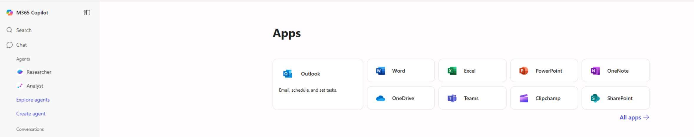
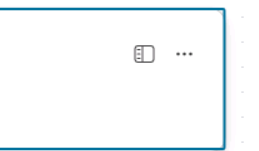
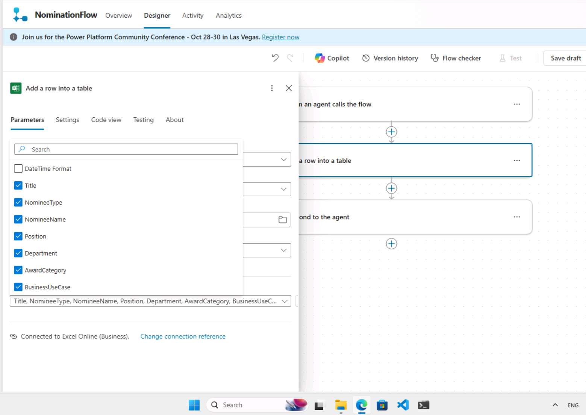
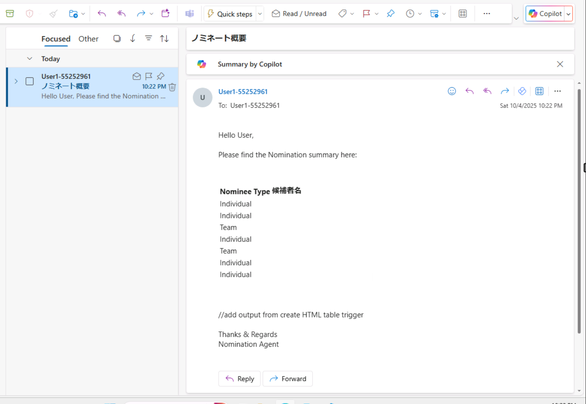

# DAY1: Build Agents with Copilot Studio (CSS)

## 注意
・ログインの際には、LAB に登録した、MSアカウントではなく、LAB 内の Instructionsの冒頭 及び Resourcesタブ内に記載のあるアカウント（Azure Credentialsなど）を利用してください。

・仮想マシンの中のIMEモードと、ご自身の端末のIMEモードが衝突しやすい環境です。かならずご自身の端末のIMEモードは、「A」（アルファベット入力）にしてください（※日本語入力モードにしないでください）

・Instructionsや、Resourcesにある内容は、クリックすると仮想マシン側に代理で入力してくれるので、直接入力せずにクリックしてみてください。

・ガイドと実際のAzureの画面が異なっていて迷う場合があると思いますが、よく確認すると大体できることばかりですので、ガイド通りにやるだけではなく、実際の画面を確認しながら、多少異なる表記があっても、推察しながら進めてください。どうしても迷う場合にこちらの資料を確認したり、質問するようにしてください。

※Azureの画面のアップデートが早くラボ環境のガイドと実態が合わなくなることは往々にしてあります。今後のためにもそういった点の耐久性をつけておいていただくことも目的にしています

※アイコンがあるところでクリックすれば、仮想マシン側に入ります。

※あくまでキーボードを介しますので、入力完了までは他の場所をクリックしたりしないようにしてください。

※英語での記載のため、ブラウザの翻訳機能が使えます。但し翻訳した状態で、上記の入力補完のアイコンなどをクリックすると、翻訳したまま入力されてしまいますので注意してください。

----
## リンク集
- パートナー向けの Microsoft 365 Copilot デモの可能性
    - クリックスルーSMB デモ： https://aka.ms/CopilotSMBClickThruDemos 
    - 自分ででもをビルドする： https://cloudpartners.transform.microsoft.com/download?assetname=assets%2FCopilot-Partner-Demo-Kit.zip&download=1
    - 没入型体験：https://cloudpartners.transform.microsoft.com/partner-gtm/csp/copilot?tab=go-to-market&sec=prove-sell
- Microsoft 365 Copilot Partner Demo Kit
    - https://cloudpartners.transform.microsoft.com/download?assetname=assets%2FCopilot-Partner-Demo-Kit.zip&download=1
    

----
## ラボのヒント・迷いそうなところのガイド

### 演習 1: Copilot Studio Agent Builder の探索
(※以下の記載は日本語翻訳した状態での表記です)

#### タスク01: 画像ジェネレーター
##### 「Microsoft Azureにサインイン」タブをクリックすると、ログイン画面が表示されます。以下のメールアドレス/ユーザー名(1)を入力し、「次へ」 (2)をクリックします。
→　ここで使うアカウントは、リソースタブのアカウントを使う。
→ Username + Passwordはなく、Username +  **「TAP」** を使ってログインするので注意

##### 左側のペインから「アプリ ランチャー」(1)を選択し、「Microsoft 365 Copilot」(2)をクリックします。
→ おそらく最初からCopilotが開くのでスキップでよいです。また左側にアプリランチャーは出てこない可能性が高いです。

----
### 演習 2: Copilot Studio で HR アシスタント エージェントを構築する

#### タスク1: 候補者を迅速にスクリーニングする
##### 左側のペインからOneDrive (1)をクリックし、マイファイル (2)をクリックします。
→ おそらく左側のペインからは選べません。メニューからAppsをクリック → OneDriveをクリック。この流れでいけます。

##### Navigate to C:\LabFiles\Day-1-Build-Agents-with-Copilot-Studio\Data
→　パスが間違えています。「DAY-1」の下にdata\CVがありますのでそちらを使ってください。合計６ファイルアップロードされるはずです。

※そのあとも同じような間違えがあります。ファイル数も異なっていますので、CVをアップロード → dataをアップロードの手順で実施してください。

#### タスク 2: トレーニング マテリアルを開発します。
特に迷う点はありません

#### タスク3: フィードバックを収集する
特に迷う点はありません

#### タスク04: パフォーマンスレビュー
特に迷う点はありません

----
### 演習3: HRエージェントにアクションを組み込む

#### Edge ブラウザに新しいタブを追加し、次のリンクを使用してMicrosoft Copilot Studioを開きます。
#### Copilot Studioの左側のペインで+ 作成 (1)を選択し、+ 新しいエージェント (2)をクリックします。
初回または、Create＋を推すと、Welcome to Microsoft Copilot Studioの画面が出る場合があります。出たら、右下のGet Startedを押して進んでください。

#### 新しいエージェントで、[構成をスキップ]を選択します。
そういう選択肢がない場合は無視して、次の「作成」に進んでください。
少し待ってから、画面上の「Details」の右側にある「Edit」を押して、指示に倣って設定を更新してください。指名代理人
※要素単位にEdit＝＞Saveが必要です。

#### 会話開始ワークフローで、トリガーノードの下のトリガーの変更 （1）を選択し、トリガーをイベント受信 （2）に変更します。
キャプチャにある「Event received」という選択肢はありません。「A message is received」を選択してください。

#### アダプティブ カードによって生成されたすべての変数がグローバルに設定されていることを確認し、[保存]を選択します。
jsonを書き換えた後、Saveを押しても、自動的にクローズされませんのでCloseを押してください。そのあと再度Saveを推します。

#### 「アダプティブ カードで質問」ノードの下で、 「ノードの追加」 (1)をクリックし、「アクションの追加」 (2)を選択して、「新しいエージェント フロー」 (3)を選択します。
アクションではなく、ツールの追加です。

#### デザイナー (1)タブをクリックし、エージェントがフローを呼び出すとき (2)ノード をクリックし、パラメータセッションで+ 入力の追加 をクリックし、テキスト (3)を選択して、テキスト ボックスにタイトル (4)を入力します。
クリックしただけでは表示されなくなっています。クリックした後、サイドバーアイコンをクリックしてプロパティを開いてください。

#### 「サインイン」をクリックします。新しいブラウザタブがポップアップ表示されるので、既にログインしているアカウントを選択してください。
一度やっても、OAuth Client Blockと出る場合があります。やり直せばポップアップでサインインダイアログが出ますので何度かやり直してみてください。

#### 詳細パラメータから、タイトル、候補者タイプ、候補者名、役職、部門、受賞カテゴリ、および BusinessCase を選択してください。
これも前の作業と同じで、サイドバーアイコン九rkっくから、実施します。

#### 変数値の設定ノードで、 「To value」の値を「Yes」 （1）に設定します。次に、「変数値の設定」ノードの下にある「ノードの追加」（2）をクリックし、 「ツールの追加」（3）を選択して、「新しいエージェントフロー」（4）を選択します。 「終了」ボタンをクリックして、エージェントフローに移動します。
この作業をする前に、一度Saveしないと、変更しないでLeaveしてよいのか？と聞かれてしまう場合がある。Saveしてから移動する。

#### テストチャットボックスに「推薦サマリーを生成」と入力してトピックをテストしてください。すると、エージェントが推薦サマリーを生成するかどうかを尋ねます。「はい」を選択してください。
テストチャットボットが出ていないときは、右上の「Test」アイコンをクリックするとテストチャットボットが出ます。

#### 「推薦エージェントが推薦概要をあなたのメールアドレスに送信しました。メールアドレスをご確認ください。」というメッセージが表示されます。現在のユーザーのメールアドレスを確認してください。エージェントからのメールが届きます。
Outlook.comを開いて、割り当てられているテストユーザーでログインしてみてください。メールが届いていればOKです。
上手くいかないときは「Generate Nomination Summary」のTopicsを開いてみてください。「Condtion」がYesのレコードが二つあったりすると、別のフローに流れてしまいます。

