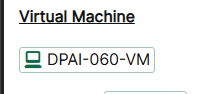

# DAY2: Azure AI Agents (CSS)

## 注意
・ログインの際には、LAB に登録した、MSアカウントではなく、LAB 内の Instructionsの冒頭 及び Resourcesタブ内に記載のあるアカウント（Azure Credentialsなど）を利用してください。

・仮想マシンの中のIMEモードと、ご自身の端末のIMEモードが衝突しやすい環境です。かならずご自身の端末のIMEモードは、「A」（アルファベット入力）にしてください（※日本語入力モードにしないでください）

・Instructionsや、Resourcesにある内容は、クリックすると仮想マシン側に代理で入力してくれるので、直接入力せずにクリックしてみてください。



・ガイドと実際のAzureの画面が異なっていて迷う場合があると思いますが、よく確認すると大体できることばかりですので、ガイド通りにやるだけではなく、実際の画面を確認しながら、多少異なる表記があっても、推察しながら進めてください。どうしても迷う場合にこちらの資料を確認したり、質問するようにしてください。

※Azureの画面のアップデートが早くラボ環境のガイドと実態が合わなくなることは往々にしてあります。今後のためにもそういった点の耐久性をつけておいていただくことも目的にしています

※アイコンがあるところでクリックすれば、仮想マシン側に入ります。

※あくまでキーボードを介しますので、入力完了までは他の場所をクリックしたりしないようにしてください。

※英語での記載のため、ブラウザの翻訳機能が使えます。但し翻訳した状態で、上記の入力補完のアイコンなどをクリックすると、翻訳したまま入力されてしまいますので注意してください。

※.envファイルにおいて、AI Foundryのプロジェクト接続文字列を入れる箇所がありますが、""で括っていないとエラーになるケースがあるとのことなので、ガイドをよく見て「""」で括られているものは真似するようにしてください。

----
## ラボのヒント・迷いそうなところのガイド

### 演習 1: AI プロジェクトをセットアップし、VS Code からチャット補完を実行する 
・Azureへログインの際は、Resources タブのUsernameとTAPを使ってログイン（Passwordは使わない）


#### 1分あたりのトークンレート制限を200Kに変更する（4）
・200Kぴったりにするのが難しいです。

・249Kなど、近い数字を選択してください（大きすぎる数字はエラーになる可能性があります）


#### On Create Azure OpenAI page, provide the following settings and select Next (6):
・ここで指定されている「Name」はポリシー違反になります。
※ラボガイド、ポリシーが誤っています。

#### 1.サブスクリプションを開いてください。


#### 2.Tagsを開きます


#### 3.ここに出る「LabInstance」の値を控えておいてください。


#### 4. OpenAIサービスの作成に戻り、Nameは「my-openai-service」＋「LabInstance」の値に変更します。

例）my-openai-servicexxxxxx

これでOKです。他の場合も、ガイドにある名前がポリシーとマッチしていないケースがあります。自動的に付与されていると思われる数値部を削除して、LabInstanceに変更してください。


#### 以下のコマンドを実行して、Azure アカウントにログインします。
az loginを実行しても何も表示されないときがあります。これはVisual Studio Codeの裏側にログインダイアログが表示されてしまっていますので、その時は、Visual Studio Codeを最小化してみてください。Sign Inダイアログが実は出ています（タスクバーには表示されない）


「Work School～」の方を選んで、現在割り当たっているアカウントの情報を入れてください。（リソースシートのUsernameを利用）


*TAPを利用してログイン

#### Python 環境を選択して、必要な依存関係がインストールされた正しい Python インタープリターで Jupyter Notebook が実行されるようにします。
実行後少し待つと、「Python Environments」というのが再度選択できるように勝手に表示されるので待ちます。
Windows Security Alertが出たらAllowを押して進んでください。

#### 以下のセルを実行すると、Azure AI Foundry プロジェクトを使用して GPT-4o モデルを操作できます。このコードはチャットクライアントを初期化し、テディベアに関するジョークのリクエストを送信し、レスポンスを出力します。最後に、チャットモデルからの出力を確認してください。

実際にチャットの結果が出る想定のところで、DefaultCredentialsのエラーが出た場合、もう一度「az login」をターミナルで実行しなおしてください。

以下の作業を再度ターミナルで実行した後、ipynbのファイルで上から順にセルを実行しなおすことで、認証情報エラーが解消されます。
```
(venv) PS C:\LabFiles\Day-2\azure-ai-agents-labs>   cp sample.env .env
(venv) PS C:\LabFiles\Day-2\azure-ai-agents-labs> az login
Select the account you want to log in with. For more information on login with Azure CLI, see https://go.microsoft.com/fwlink/?linkid=2271136

Retrieving tenants and subscriptions for the selection...

[Tenant and subscription selection]

No     Subscription name    Subscription ID                       Tenant
-----  -------------------  ------------------------------------  -------------
[1] *  Depth-xxxxx    d875e7ee-e76b-xxxx-9bd2-xxxxxxx  LODS-Prod-MCA

The default is marked with an *; the default tenant is 'LODS-Prod-MCA' and subscription is 'Depth-lod51187412' (d875e7ee-e76b-429b-9bd2-86480212ef07).     

Select a subscription and tenant (Type a number or Enter for no changes):

Tenant: LODS-Prod-MCA
Subscription: Depth-xxxxx (xxxxxx-e76b-xxxx-9bd2-xxxxxxxxxx)

[Announcements]
With the new Azure CLI login experience, you can select the subscription you want to use more easily. Learn more about it and its configuration at https://go.microsoft.com/fwlink/?linkid=2271236

If you encounter any problem, please open an issue at https://aka.ms/azclibug

[Warning] The login output has been updated. Please be aware that it no longer displays the full list of available subscriptions by default.

(venv) PS C:\LabFiles\Day-2\azure-ai-agents-labs>
```

---
### 演習2: シンプルなAIエージェントを構築する

特に迷うことはありません。ガイドと少し出力が違いますが、「RunStatus.COMPLETED」となっていれば正常に動作しています。

Messagesの内容を観察するとよいです。

---
### 演習3: マルチエージェントシステムの開発

特に迷うことはありません。


---
### メモ：AI Foundryへの接続文字列例
以下のように「https://~」ではないので注意。
eastus.api.azureml.ms;xxxx-xxxxxx-xxxxx-xxxx;AgenticAI;ai-foundry-projectxxxxxxxx
