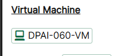
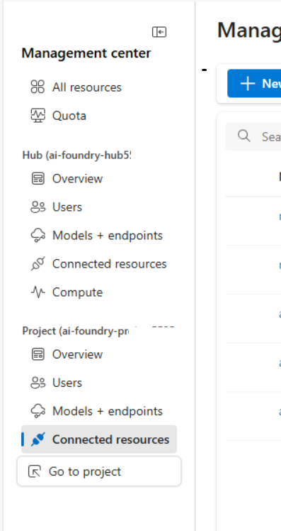
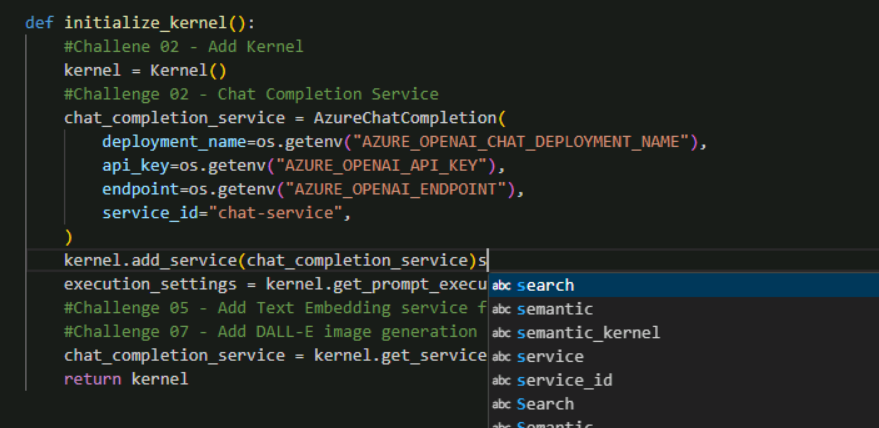
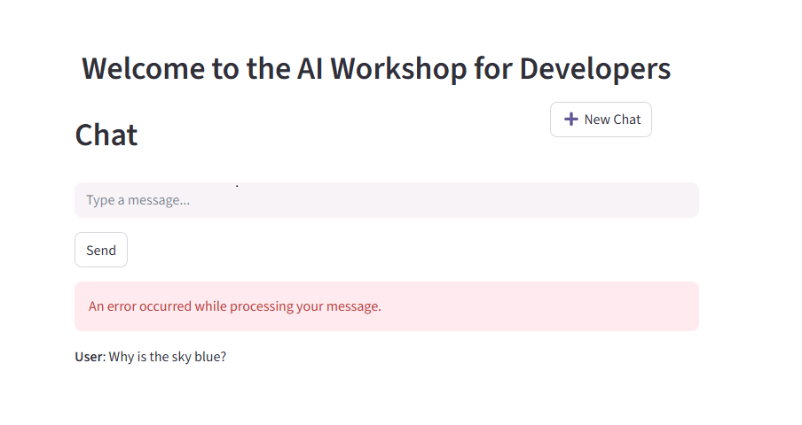
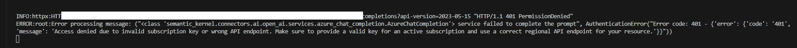
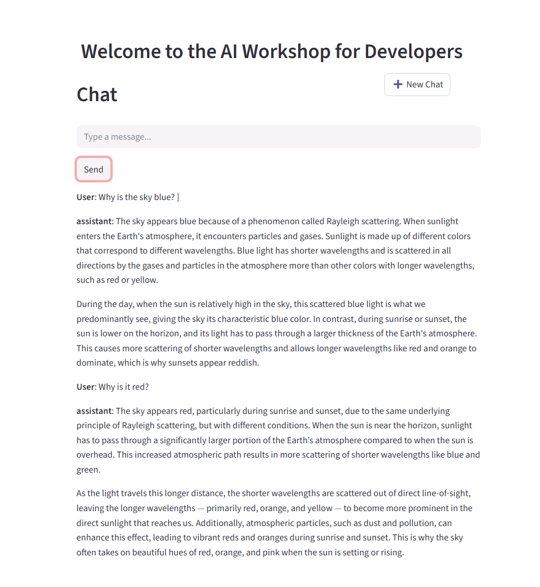
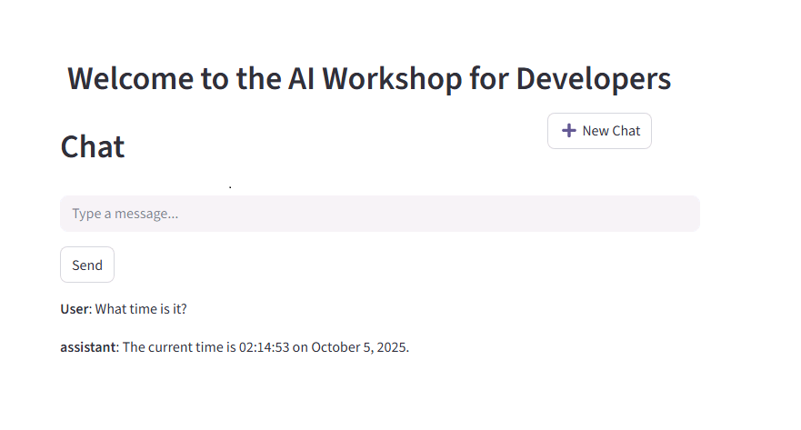
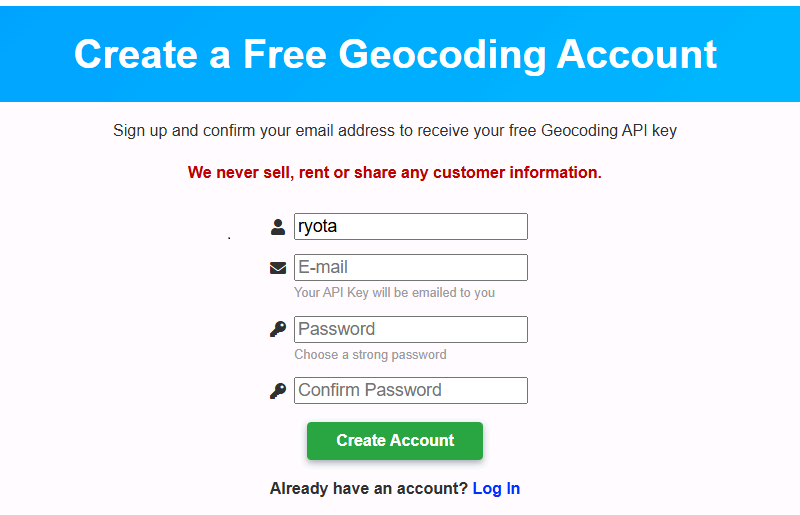

# DAY3: Developing a Custom RAG App Using Azure AI Foundry and Explore Semantic Kernel (CSS)

## 注意
・Labのガイドにある「地域（Region）」を間違えないようにしてください。EAST USとEAST US2は別物ですので注意が必要です。

・ログインの際には、LAB に登録した、MSアカウントではなく、LAB 内の Instructionsの冒頭 及び Resourcesタブ内に記載のあるアカウント（Azure Credentialsなど）を利用してください。

・仮想マシンの中のIMEモードと、ご自身の端末のIMEモードが衝突しやすい環境です。かならずご自身の端末のIMEモードは、「A」（アルファベット入力）にしてください（※日本語入力モードにしないでください）

・Instructionsや、Resourcesにある内容は、クリックすると仮想マシン側に代理で入力してくれるので、直接入力せずにクリックしてみてください。

・ガイドと実際のAzureの画面が異なっていて迷う場合があると思いますが、よく確認すると大体できることばかりですので、ガイド通りにやるだけではなく、実際の画面を確認しながら、多少異なる表記があっても、推察しながら進めてください。どうしても迷う場合にこちらの資料を確認したり、質問するようにしてください。

※Azureの画面のアップデートが早くラボ環境のガイドと実態が合わなくなることは往々にしてあります。今後のためにもそういった点の耐久性をつけておいていただくことも目的にしています

※アイコンがあるところでクリックすれば、仮想マシン側に入ります。

※あくまでキーボードを介しますので、入力完了までは他の場所をクリックしたりしないようにしてください。

※英語での記載のため、ブラウザの翻訳機能が使えます。但し翻訳した状態で、上記の入力補完のアイコンなどをクリックすると、翻訳したまま入力されてしまいますので注意してください。

----
## ラボのヒント・迷いそうなところのガイド

### 演習 1:
ほとんどがDAY1～DAY2に実施した内容の復習です。思い出しながら実施してみてください。

#### AI Foundry | AI Searchページで、+ 作成を選択してAzure OpenAI リソースを作成します。
これは間違えています。作るのは、Azure OpenAI リソースではなく、Azure AI Search リソースです。価格帯も「標準S0」ではなく、標準のままでOKです。

#### Azure AI Foundry タブに戻り、Management Centerを選択します。
DAY2までに実施した内容ですが、AI FoundryのOverviewページから、「Open in management center」をクリックして移動します。

#### 「プロジェクトで「接続済みリソース」を選択します。次に「+新しい接続」を選択します。「Azure AI Search」を選択し、「接続の追加」を選択して「閉じる」を選択します。」、「次に、Foundryハブの下にある「接続済みリソース」を選択します。次に、 「+新しい接続」を選択します。「Azure AI Search」を選択し、「接続の追加」を選択して「閉じる」を選択します。」
この個所はわかりづらいのですが、「Management center」を開いた状態で、「Hub」と「Project」がメニューん出ていますのでそれぞれに接続してくださいという意味です。

### タスク1: プロジェクトの要件をインストールする
#### （1）に移動し、Custom-RAG-App（2）フォルダを選択して、フォルダの選択（3）をクリックします
DAY-3\Custom-RAG-Appフォルダを開いてください。

----
### 演習2
躓くところはありません。ガイド通りに進めてください。

----
### 演習3: RAGパフォーマンスの評価と最適化

#### 次に評価スクリプトを実行します。
#### アップグレードが完了したら、以下のコマンドを再実行します。
→同じコマンドの実行要求が書いてあり間違えています。
「python evaluate.py」は一度だけで十分です。

----
### 演習4: セマンティックカーネルの基礎

#### この演習では、途中で、「Python」または「C#」を選んで進めることができます。どちらかまたは両方を実施して進めてください。

#### # Challenge 02 - Chat Completion Serviceファイルの（1）セクションに次のコードを追加します。
Pythonの場合、コピーして貼り付けたりするとインデントがずれる場合があります。サンプルと同じようにインデントをそろえてください。

### 以下のコマンドを実行して、requirements.txt ファイルからパッケージをインストールします。
非常に時間がかかります。３０分～１時間程度かかる場合がありますので完了までお待ちください。

### チャットエラーが出る場合は、一度VisualStudioCodeのターミナルをチェックしてください。

以下のようにエラー原因が出力されています。

プログラムに加えるべきコードが漏れているまたは、.envの設定が誤っているのどちらになりますので手順を見直してください。

正しく直すと以下のように、出力されます

### 5. #Import Modulesファイルのセクションに次のコードを追加します。

ガイドでは以下のようになっていますが、間違えています。

[間違え]

from semantic_kernel.connectors.ai.open_ai.prompt_execution_settings.azure_chat_prompt_execution_settings import (
    AzureChatPromptExecutionSettings,
)
from plugins.time_plugin import TimePlugins

[正解] *TimePluginsではなく、TimePluginです

from semantic_kernel.connectors.ai.open_ai.prompt_execution_settings.azure_chat_prompt_execution_settings import (
    AzureChatPromptExecutionSettings,
)
from plugins.time_plugin import TimePlugin

正しく動くと以下のように日時が出ます

----
## タスク3: ジオコーディングプラグインを作成してインポートする
ここについては、ご自身の個人用 MS アカウントをラボように作成してもらっていると思いますので、その MS アカウントを使ってアカウントを作成することを推奨します。

